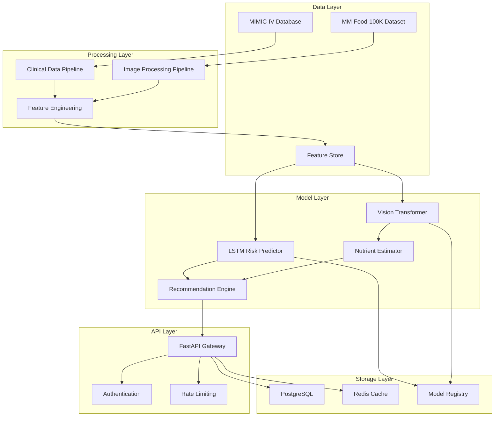
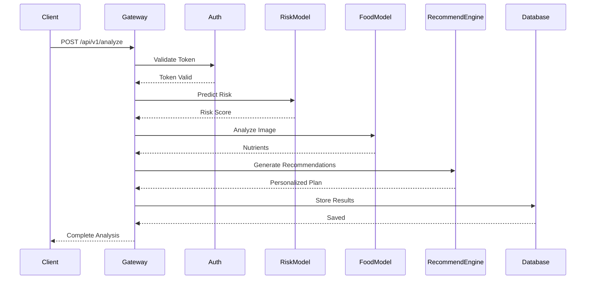

## High-Level Architecture

The T2DM AI Risk Predictor is built on a modular, microservices-inspired architecture that separates concerns into distinct components:



## Component Breakdown

### 1. Data Pipeline

<AccordionGroup>
  <Accordion title="MIMIC-IV Clinical Data Pipeline" icon="database">
    **Responsibilities:**
    - Extract EHR data from MIMIC-IV
    - Filter T2DM-relevant cohort using ICD-10 codes
    - Process temporal sequences (vitals, labs)
    - Handle missing data and outliers
    
    **Key Technologies:**
    - PostgreSQL for data storage
    - Pandas & Polars for data manipulation
    - Great Expectations for data quality
    
    **Output:**
    - Structured clinical feature matrices
    - Temporal sequences for LSTM input
    - Patient metadata and labels
  </Accordion>

  <Accordion title="MM-Food-100K Vision Pipeline" icon="image">
    **Responsibilities:**
    - Load and preprocess food images
    - Apply data augmentation
    - Generate nutritional annotations
    - Create train/val/test splits
    
    **Key Technologies:**
    - PyTorch DataLoader
    - Albumentations for augmentation
    - CLIP for zero-shot classification
    
    **Output:**
    - Preprocessed image tensors (224x224)
    - Multi-label nutritional annotations
    - Portion size estimates
  </Accordion>

  <Accordion title="Feature Engineering" icon="gears">
    **Clinical Features:**
    - Demographics: age, sex, ethnicity, BMI
    - Vital signs: BP, heart rate, temperature
    - Laboratory values: HbA1c, glucose, lipid panel
    - Temporal patterns: glucose trends, weight changes
    - Comorbidities: hypertension, dyslipidemia
    
    **Vision Features:**
    - Food category embeddings
    - Portion size vectors
    - Color and texture features
    - Nutritional composition vectors
  </Accordion>
</AccordionGroup>

### 2. Machine Learning Models

#### Clinical Risk Prediction (LSTM)

```python
class ClinicalRiskLSTM(nn.Module):
    def __init__(self, config):
        super().__init__()
        
        # Static feature encoder
        self.static_encoder = nn.Sequential(
            nn.Linear(config.static_dim, 128),
            nn.ReLU(),
            nn.Dropout(0.3),
            nn.Linear(128, 64)
        )
        
        # Temporal sequence encoder
        self.lstm = nn.LSTM(
            input_size=config.temporal_dim,
            hidden_size=config.hidden_size,
            num_layers=config.num_layers,
            dropout=config.dropout,
            bidirectional=True,
            batch_first=True
        )
        
        # Attention mechanism
        self.attention = nn.MultiheadAttention(
            embed_dim=config.hidden_size * 2,
            num_heads=8
        )
        
        # Risk prediction head
        self.classifier = nn.Sequential(
            nn.Linear(config.hidden_size * 2 + 64, 128),
            nn.ReLU(),
            nn.Dropout(0.3),
            nn.Linear(128, 1)
        )
    
    def forward(self, static_features, temporal_sequences):
        # Encode static features
        static_encoded = self.static_encoder(static_features)
        
        # Process temporal sequences
        lstm_out, (h_n, c_n) = self.lstm(temporal_sequences)
        
        # Apply attention
        attn_out, _ = self.attention(lstm_out, lstm_out, lstm_out)
        
        # Pool temporal features
        temporal_features = attn_out[:, -1, :]
        
        # Combine features
        combined = torch.cat([static_encoded, temporal_features], dim=1)
        
        # Predict risk
        risk_score = self.classifier(combined)
        return torch.sigmoid(risk_score)
```

**Model Specifications:**
- Input: Static features (15 dims) + Temporal sequences (30 timesteps × 20 features)
- Architecture: Bidirectional LSTM with 3 layers, 256 hidden units
- Regularization: Dropout (0.3), Weight decay (0.01)
- Output: T2DM risk probability [0, 1]
- Training: Binary cross-entropy with class weights
- Performance: AUROC 0.912, AUPRC 0.847

#### Food Recognition (Vision Transformer)

```python
class FoodVisionTransformer(nn.Module):
    def __init__(self, config):
        super().__init__()
        
        # Vision Transformer backbone
        self.vit = timm.create_model(
            'vit_base_patch16_224',
            pretrained=True,
            num_classes=0  # Remove classifier
        )
        
        # Multi-task heads
        self.food_classifier = nn.Linear(768, config.num_classes)
        self.portion_estimator = nn.Sequential(
            nn.Linear(768, 256),
            nn.ReLU(),
            nn.Linear(256, 1)
        )
        self.nutrient_regressor = nn.Sequential(
            nn.Linear(768, 512),
            nn.ReLU(),
            nn.Dropout(0.2),
            nn.Linear(512, config.num_nutrients)
        )
    
    def forward(self, images):
        # Extract features
        features = self.vit(images)
        
        # Multi-task outputs
        food_logits = self.food_classifier(features)
        portion_size = self.portion_estimator(features)
        nutrients = self.nutrient_regressor(features)
        
        return {
            'food_logits': food_logits,
            'portion_size': portion_size,
            'nutrients': nutrients
        }
```

**Model Specifications:**
- Backbone: ViT-B/16 pretrained on ImageNet-21k
- Input: RGB images (224×224×3)
- Tasks: Food classification (101 classes), portion estimation, nutrient prediction
- Training: Multi-task learning with weighted loss
- Performance: 95.3% top-1 accuracy, 42.5 kcal MAE

### 3. Recommendation Engine

The recommendation engine uses a hybrid approach combining:

1. **Rule-Based System**: Evidence-based nutritional guidelines (ADA, WHO)
2. **Collaborative Filtering**: Learn from similar patient outcomes
3. **Reinforcement Learning**: Adapt recommendations based on feedback

```python
class RecommendationEngine:
    def __init__(self, risk_model, food_model):
        self.risk_model = risk_model
        self.food_model = food_model
        self.nutrition_db = NutritionDatabase()
        self.rl_agent = BanditRecommender()
    
    def generate(self, patient_data, current_meal=None):
        # Assess current risk
        risk_score = self.risk_model.predict(patient_data)
        risk_category = self._categorize_risk(risk_score)
        
        # Analyze current meal if provided
        meal_analysis = None
        if current_meal:
            meal_analysis = self.food_model.analyze(current_meal)
        
        # Generate personalized recommendations
        recommendations = []
        
        # Risk-stratified guidelines
        if risk_category == "high":
            recommendations.extend(self._high_risk_guidelines())
        elif risk_category == "moderate":
            recommendations.extend(self._moderate_risk_guidelines())
        
        # Meal-specific feedback
        if meal_analysis:
            recommendations.extend(
                self._analyze_meal(meal_analysis, patient_data)
            )
        
        # Personalized meal suggestions
        suggested_meals = self._suggest_alternatives(
            patient_data, risk_category
        )
        recommendations.extend(suggested_meals)
        
        # Learn from interaction
        self.rl_agent.update(patient_data, recommendations)
        
        return recommendations
```

## API Architecture

### RESTful API Design



### Key Endpoints

| Endpoint | Method | Description |
|----------|--------|-------------|
| `/api/v1/risk/predict` | POST | Predict T2DM risk from clinical data |
| `/api/v1/food/analyze` | POST | Analyze food image |
| `/api/v1/recommendations/generate` | POST | Get personalized nutrition plan |
| `/api/v1/patient/profile` | GET | Retrieve patient profile |
| `/api/v1/models/info` | GET | Model version information |

## Deployment Architecture

### Containerized Deployment

```yaml
# Kubernetes deployment configuration
apiVersion: apps/v1
kind: Deployment
metadata:
  name: t2dm-predictor
spec:
  replicas: 3
  template:
    spec:
      containers:
      - name: api
        image: t2dm-predictor:v1.0.0
        resources:
          limits:
            nvidia.com/gpu: 1
            memory: "8Gi"
          requests:
            cpu: "2"
            memory: "4Gi"
        env:
        - name: MODEL_PATH
          value: /models
        volumeMounts:
        - name: models
          mountPath: /models
      volumes:
      - name: models
        persistentVolumeClaim:
          claimName: model-storage
```

### Scalability Considerations

<CardGroup cols={2}>
  <Card title="Horizontal Scaling" icon="arrows-left-right">
    - Load balancer (NGINX/HAProxy)
    - Multiple API replicas
    - Auto-scaling based on CPU/GPU utilization
    - Request queueing with Celery
  </Card>
  
  <Card title="Caching Strategy" icon="database">
    - Redis for frequently accessed predictions
    - CDN for static assets
    - Model output caching
    - Feature store for preprocessed data
  </Card>
  
  <Card title="Model Serving" icon="server">
    - TorchServe for PyTorch models
    - ONNX Runtime for optimized inference
    - Batch prediction for efficiency
    - GPU acceleration with CUDA
  </Card>
  
  <Card title="Monitoring" icon="chart-line">
    - Prometheus for metrics
    - Grafana for visualization
    - ELK stack for logging
    - Model performance tracking
  </Card>
</CardGroup>

## Security & Privacy

<Warning>
  **HIPAA Compliance Required**: This system handles Protected Health Information (PHI) 
  and must comply with HIPAA, GDPR, and other relevant regulations.
</Warning>

### Security Measures

1. **Data Encryption**
   - TLS 1.3 for data in transit
   - AES-256 for data at rest
   - Field-level encryption for PHI

2. **Access Control**
   - OAuth 2.0 / JWT authentication
   - Role-based access control (RBAC)
   - API rate limiting
   - Audit logging

3. **Privacy Preservation**
   - De-identification of patient data
   - Differential privacy for model training
   - Federated learning capability
   - Secure multi-party computation

## Performance Optimization

### Model Optimization

```python
# Example: Convert model to ONNX for faster inference
import torch.onnx

def export_to_onnx(model, dummy_input, output_path):
    torch.onnx.export(
        model,
        dummy_input,
        output_path,
        export_params=True,
        opset_version=14,
        do_constant_folding=True,
        input_names=['input'],
        output_names=['output'],
        dynamic_axes={'input': {0: 'batch_size'},
                      'output': {0: 'batch_size'}}
    )

# Quantization for edge deployment
from torch.quantization import quantize_dynamic
quantized_model = quantize_dynamic(
    model, {nn.Linear, nn.LSTM}, dtype=torch.qint8
)
```

### Inference Optimization

| Technique | Speedup | Accuracy Trade-off |
|-----------|---------|-------------------|
| ONNX Runtime | 2.1x | None |
| TensorRT | 3.5x | <0.1% |
| Quantization (INT8) | 4.2x | <0.5% |
| Model Pruning | 2.8x | <1.0% |

## Technology Stack

<Tabs>
  <Tab title="Backend">
    - **Framework**: FastAPI, Uvicorn
    - **ML**: PyTorch, Transformers, timm
    - **Data**: Pandas, Polars, NumPy
    - **Database**: PostgreSQL, Redis
    - **Message Queue**: Celery, RabbitMQ
  </Tab>
  
  <Tab title="Infrastructure">
    - **Containerization**: Docker, Kubernetes
    - **CI/CD**: GitHub Actions, ArgoCD
    - **Monitoring**: Prometheus, Grafana
    - **Logging**: ELK Stack
    - **Cloud**: AWS/GCP/Azure
  </Tab>
  
  <Tab title="ML Ops">
    - **Experiment Tracking**: MLflow, Weights & Biases
    - **Model Registry**: MLflow Model Registry
    - **Feature Store**: Feast
    - **Data Versioning**: DVC
    - **Model Serving**: TorchServe, ONNX Runtime
  </Tab>
</Tabs>

## Next Steps

<CardGroup cols={2}>
  <Card title="Data Pipeline" icon="database" href="/data/mimic-iv-setup">
    Learn how to set up and process datasets
  </Card>
  <Card title="Model Training" icon="brain" href="/models/clinical-risk-lstm">
    Deep dive into model architectures
  </Card>
  <Card title="API Documentation" icon="code" href="/api-reference/risk/predict">
    Explore API endpoints and usage
  </Card>
  <Card title="Deployment" icon="rocket" href="/deployment/setup">
    Deploy to production
  </Card>
</CardGroup>
