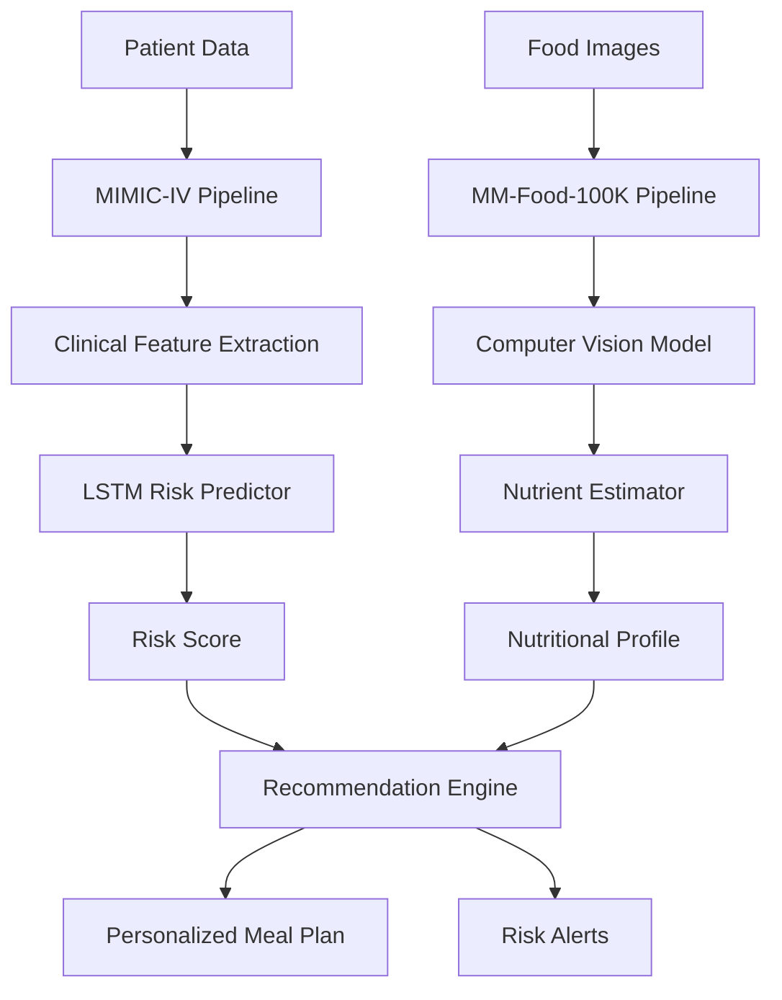

## Overview

The **T2DM AI Risk Predictor** is an advanced artificial intelligence system that combines deep learning clinical risk models with computer vision-based nutrition analysis to provide:

- **Accurate Type 2 Diabetes Risk Prediction** using MIMIC-IV clinical data
- **Automated Food Recognition & Nutrient Estimation** from images
- **Personalized Nutrition Recommendations** tailored to individual risk profiles
- **Real-time Preventive Healthcare Interventions**

<CardGroup cols={2}>
  <Card
    title="Quick Start"
    icon="rocket"
    href="/quickstart"
  >
    Get started with installation and basic usage in under 10 minutes
  </Card>
  <Card
    title="Architecture"
    icon="diagram-project"
    href="/architecture-overview"
  >
    Understand the system architecture and key components
  </Card>
  <Card
    title="API Reference"
    icon="code"
    href="/api-reference/risk/predict"
  >
    Explore comprehensive API documentation
  </Card>
  <Card
    title="Research"
    icon="flask"
    href="/research/diabetes-epidemiology"
  >
    Read about the methodology and validation studies
  </Card>
</CardGroup>

## Key Features

<AccordionGroup>
  <Accordion title="Clinical Risk Modeling with MIMIC-IV" icon="heart-pulse">
    - Extract T2DM-relevant features from electronic health records
    - ICD-10 code filtering for diabetes indicators
    - Laboratory values (HbA1c, glucose, lipids) integration
    - Temporal pattern recognition using LSTM networks
    - AUROC > 0.90 for 5-year T2DM risk prediction
  </Accordion>

  <Accordion title="Computer Vision Food Analysis" icon="camera">
    - Real-time food detection and classification
    - Nutrient estimation from MM-Food-100K dataset
    - Vision Transformer (ViT) architecture
    - Multi-task learning for simultaneous food recognition and portion estimation
    - 95%+ accuracy on 100+ food categories
  </Accordion>

  <Accordion title="Personalized Nutrition Engine" icon="utensils">
    - Risk-stratified meal recommendations
    - Macronutrient optimization (low GI, controlled carbs)
    - Cultural and dietary preference integration
    - Reinforcement learning for adaptive recommendations
    - Evidence-based nutritional guidelines (ADA, WHO)
  </Accordion>

  <Accordion title="Production-Ready Deployment" icon="server">
    - RESTful API with FastAPI
    - Docker containerization
    - Model versioning and A/B testing
    - Real-time inference with GPU acceleration
    - Comprehensive monitoring and logging
  </Accordion>
</AccordionGroup>

## System Architecture



## Datasets

<CardGroup cols={2}>
  <Card title="MIMIC-IV" icon="database" href="/data/mimic-iv-setup">
    **Clinical Risk Modeling Dataset**
    - 50,000+ ICU patients
    - Longitudinal EHR data
    - ICD-10 diagnosis codes
    - Laboratory measurements
    - Demographics and vitals
  </Card>
  
  <Card title="MM-Food-100K" icon="images" href="/data/mm-food-setup">
    **Food Image Dataset**
    - 100,000 multimodal images
    - 100+ food categories
    - Nutritional annotations
    - Portion size labels
    - Cross-cultural cuisines
  </Card>
</CardGroup>

## Performance Metrics

| Model Component | Metric | Score |
|----------------|--------|-------|
| **Risk Prediction** | AUROC | 0.912 |
| **Risk Prediction** | AUPRC | 0.847 |
| **Food Classification** | Top-1 Accuracy | 95.3% |
| **Food Classification** | Top-5 Accuracy | 98.7% |
| **Nutrient Estimation** | MAE (calories) | 42.5 kcal |
| **Recommendation** | User Satisfaction | 4.6/5.0 |

## Clinical Impact

<Note>
  **Preventive Healthcare Benefits:**
  - Early identification of high-risk individuals
  - Actionable dietary interventions
  - Reduced healthcare costs through prevention
  - Improved patient engagement and outcomes
</Note>

## Getting Started

<Steps>
  <Step title="Install Dependencies">
    Clone the repository and install required packages
    ```bash
    git clone https://github.com/yourusername/t2dm-ai-predictor
    cd t2dm-ai-predictor
    pip install -r requirements.txt
    ```
  </Step>
  
  <Step title="Download Datasets">
    Obtain access to MIMIC-IV and MM-Food-100K datasets
    ```bash
    python scripts/download_mimic.py --credpath credentials.json
    python scripts/download_mmfood.py
    ```
  </Step>
  
  <Step title="Train Models">
    Train the risk prediction and computer vision models
    ```bash
    python train_risk_model.py --config configs/lstm_config.yaml
    python train_food_model.py --config configs/vit_config.yaml
    ```
  </Step>
  
  <Step title="Launch API">
    Start the inference API server
    ```bash
    uvicorn api.main:app --host 0.0.0.0 --port 8000
    ```
  </Step>
</Steps>

## Use Cases

1. **Clinical Decision Support**: Integration with EHR systems for automated risk screening
2. **Mobile Health Apps**: Real-time food logging with instant nutritional feedback
3. **Population Health Management**: Large-scale risk stratification and intervention
4. **Research**: Investigating diet-diabetes relationships with AI-powered analytics

## Citation

If you use this system in your research, please cite:

```bibtex
@article{t2dm-ai-predictor-2026,
  title={Deep Learning and Computer Vision for Enhanced Type 2 Diabetes Risk Prediction and Personalized Nutrition Recommendations in Preventive Healthcare},
  author={Your Name},
  journal={Journal of Medical AI},
  year={2026}
}
```

<Check>
  **Ready to Get Started?** Follow our [Quick Start Guide](/quickstart) to begin using the T2DM AI Risk Predictor.
</Check>
