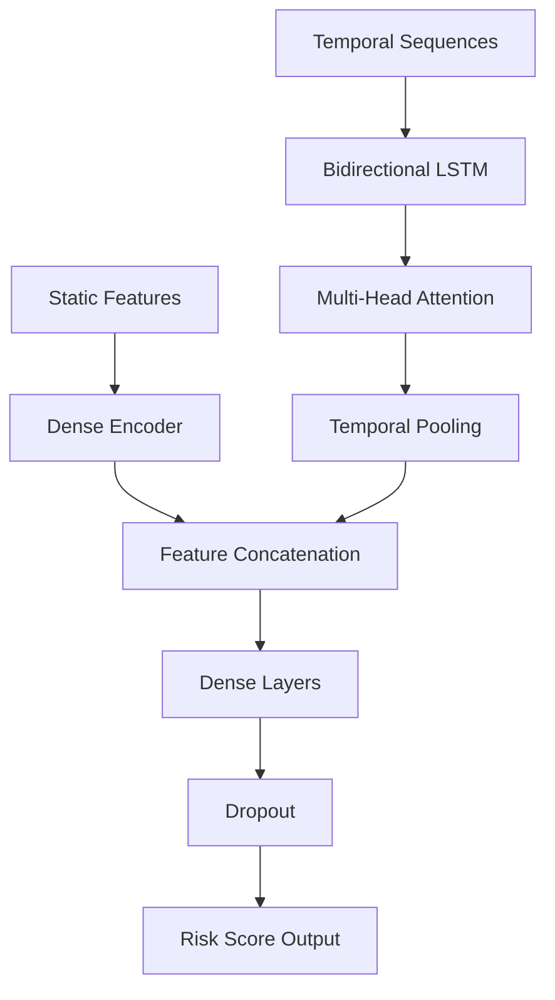

## Overview

The Clinical Risk LSTM model is a bidirectional Long Short-Term Memory network designed to predict 5-year Type 2 Diabetes risk from longitudinal electronic health record (EHR) data.

<Info>
  **Key Features:**
  - Temporal pattern recognition from time-series clinical data
  - Multi-head attention mechanism for interpretability
  - AUROC: 0.912 on held-out test set
  - Real-time inference (<50ms per patient)
</Info>

## Model Architecture



### Architecture Components

<AccordionGroup>
  <Accordion title="Static Feature Encoder" icon="table">
    Processes time-invariant patient characteristics:
    
    ```python
    self.static_encoder = nn.Sequential(
        nn.Linear(static_dim, 128),
        nn.BatchNorm1d(128),
        nn.ReLU(),
        nn.Dropout(0.3),
        nn.Linear(128, 64),
        nn.ReLU()
    )
    ```
    
    **Input Features (15 dimensions):**
    - Demographics: age, sex, ethnicity
    - Body composition: BMI, waist circumference
    - Family history: diabetes, cardiovascular disease
    - Lifestyle: smoking status, alcohol use, physical activity
  </Accordion>

  <Accordion title="Temporal Sequence Encoder" icon="clock">
    Captures time-series patterns using Bidirectional LSTM:
    
    ```python
    self.lstm = nn.LSTM(
        input_size=temporal_dim,        # 20 features
        hidden_size=256,                 # 256 hidden units
        num_layers=3,                    # 3 stacked layers
        dropout=0.3,                     # Inter-layer dropout
        bidirectional=True,              # Process forward & backward
        batch_first=True
    )
    ```
    
    **Temporal Features (20 dimensions × 30 timesteps):**
    - Vital signs: BP, heart rate, temperature
    - Laboratory values: glucose, HbA1c, lipid panel
    - Anthropometrics: weight trajectory, BMI changes
    - Medications: antihypertensives, statins
  </Accordion>

  <Accordion title="Attention Mechanism" icon="eye">
    Multi-head attention highlights important timesteps:
    
    ```python
    self.attention = nn.MultiheadAttention(
        embed_dim=512,      # BiLSTM output: 256*2
        num_heads=8,        # 8 attention heads
        dropout=0.1
    )
    ```
    
    **Benefits:**
    - Identifies critical time periods (e.g., recent glucose spikes)
    - Provides interpretability through attention weights
    - Handles variable-length sequences
  </Accordion>

  <Accordion title="Classification Head" icon="brain">
    Final layers for risk prediction:
    
    ```python
    self.classifier = nn.Sequential(
        nn.Linear(512 + 64, 256),     # Concat static + temporal
        nn.BatchNorm1d(256),
        nn.ReLU(),
        nn.Dropout(0.4),
        nn.Linear(256, 128),
        nn.ReLU(),
        nn.Dropout(0.3),
        nn.Linear(128, 1),             # Single output
        nn.Sigmoid()                   # Risk probability [0,1]
    )
    ```
  </Accordion>
</AccordionGroup>

## Complete Implementation

```python model.py
import torch
import torch.nn as nn
import torch.nn.functional as F

class ClinicalRiskLSTM(nn.Module):
    """
    Bidirectional LSTM with Attention for T2DM Risk Prediction
    
    Args:
        config: Model configuration object containing:
            - static_dim: Dimension of static features
            - temporal_dim: Dimension of temporal features
            - sequence_length: Length of temporal sequences
            - hidden_size: LSTM hidden size
            - num_layers: Number of LSTM layers
            - dropout: Dropout probability
    """
    
    def __init__(self, config):
        super(ClinicalRiskLSTM, self).__init__()
        
        self.config = config
        
        # Static feature encoder
        self.static_encoder = nn.Sequential(
            nn.Linear(config.static_dim, 128),
            nn.BatchNorm1d(128),
            nn.ReLU(),
            nn.Dropout(config.dropout),
            nn.Linear(128, 64),
            nn.ReLU()
        )
        
        # Temporal sequence encoder
        self.lstm = nn.LSTM(
            input_size=config.temporal_dim,
            hidden_size=config.hidden_size,
            num_layers=config.num_layers,
            dropout=config.dropout if config.num_layers > 1 else 0,
            bidirectional=True,
            batch_first=True
        )
        
        # Attention mechanism
        self.attention = nn.MultiheadAttention(
            embed_dim=config.hidden_size * 2,
            num_heads=8,
            dropout=0.1,
            batch_first=True
        )
        
        # Classification head
        self.classifier = nn.Sequential(
            nn.Linear(config.hidden_size * 2 + 64, 256),
            nn.BatchNorm1d(256),
            nn.ReLU(),
            nn.Dropout(0.4),
            nn.Linear(256, 128),
            nn.ReLU(),
            nn.Dropout(0.3),
            nn.Linear(128, 1)
        )
        
    def forward(self, static_features, temporal_sequences, return_attention=False):
        """
        Forward pass
        
        Args:
            static_features: (batch_size, static_dim)
            temporal_sequences: (batch_size, sequence_length, temporal_dim)
            return_attention: Whether to return attention weights
            
        Returns:
            risk_score: (batch_size, 1) probability of T2DM
            attention_weights: (optional) attention weights
        """
        batch_size = static_features.size(0)
        
        # Encode static features
        static_encoded = self.static_encoder(static_features)  # (B, 64)
        
        # Process temporal sequences
        lstm_out, (h_n, c_n) = self.lstm(temporal_sequences)  # (B, L, 512)
        
        # Apply attention
        attn_out, attn_weights = self.attention(
            lstm_out, lstm_out, lstm_out
        )  # (B, L, 512)
        
        # Temporal pooling (use last timestep)
        temporal_features = attn_out[:, -1, :]  # (B, 512)
        
        # Combine static and temporal features
        combined = torch.cat([static_encoded, temporal_features], dim=1)  # (B, 576)
        
        # Predict risk
        logits = self.classifier(combined)  # (B, 1)
        risk_score = torch.sigmoid(logits)
        
        if return_attention:
            return risk_score, attn_weights
        return risk_score
    
    def get_feature_importance(self, static_features, temporal_sequences):
        """
        Compute SHAP-style feature importance
        
        Returns:
            importance_dict: Dictionary of feature importances
        """
        import shap
        
        # Create background dataset (100 random samples)
        background = (
            static_features[:100],
            temporal_sequences[:100]
        )
        
        # Create explainer
        explainer = shap.DeepExplainer(self, background)
        
        # Compute SHAP values
        shap_values = explainer.shap_values([static_features, temporal_sequences])
        
        return {
            'static_shap': shap_values[0],
            'temporal_shap': shap_values[1]
        }
```

## Training Configuration

### Hyperparameters

```yaml config/lstm_config.yaml
model:
  type: "ClinicalRiskLSTM"
  static_dim: 15
  temporal_dim: 20
  sequence_length: 30
  hidden_size: 256
  num_layers: 3
  dropout: 0.3

training:
  epochs: 100
  batch_size: 64
  learning_rate: 0.001
  weight_decay: 0.01
  optimizer: "AdamW"
  scheduler:
    type: "CosineAnnealingLR"
    T_max: 100
    eta_min: 1e-6
  
  early_stopping:
    patience: 10
    min_delta: 0.001
    metric: "val_auroc"
    mode: "max"

loss:
  type: "BCEWithLogitsLoss"
  pos_weight: 2.5  # Account for class imbalance
  
data:
  train_split: 0.7
  val_split: 0.15
  test_split: 0.15
  random_seed: 42
  
augmentation:
  temporal_masking: 0.1
  temporal_jitter: 0.05
  gaussian_noise: 0.01
```

### Training Script

```python train.py
import torch
import torch.nn as nn
from torch.utils.data import DataLoader
from torch.optim import AdamW
from torch.optim.lr_scheduler import CosineAnnealingLR
import yaml
from tqdm import tqdm

from model import ClinicalRiskLSTM
from dataset import ClinicalDataset
from metrics import compute_metrics

def train_epoch(model, loader, optimizer, criterion, device):
    """Train for one epoch"""
    model.train()
    total_loss = 0
    
    for batch in tqdm(loader, desc="Training"):
        static = batch['static'].to(device)
        temporal = batch['temporal'].to(device)
        labels = batch['label'].to(device)
        
        optimizer.zero_grad()
        
        # Forward pass
        outputs = model(static, temporal)
        loss = criterion(outputs.squeeze(), labels)
        
        # Backward pass
        loss.backward()
        torch.nn.utils.clip_grad_norm_(model.parameters(), max_norm=1.0)
        optimizer.step()
        
        total_loss += loss.item()
    
    return total_loss / len(loader)

def validate(model, loader, criterion, device):
    """Validate model"""
    model.eval()
    total_loss = 0
    all_preds = []
    all_labels = []
    
    with torch.no_grad():
        for batch in loader:
            static = batch['static'].to(device)
            temporal = batch['temporal'].to(device)
            labels = batch['label'].to(device)
            
            outputs = model(static, temporal)
            loss = criterion(outputs.squeeze(), labels)
            
            total_loss += loss.item()
            all_preds.extend(outputs.cpu().numpy())
            all_labels.extend(labels.cpu().numpy())
    
    # Compute metrics
    metrics = compute_metrics(all_preds, all_labels)
    metrics['loss'] = total_loss / len(loader)
    
    return metrics

def main():
    # Load config
    with open('configs/lstm_config.yaml') as f:
        config = yaml.safe_load(f)
    
    # Setup
    device = torch.device('cuda' if torch.cuda.is_available() else 'cpu')
    
    # Load data
    train_dataset = ClinicalDataset('data/processed/train.parquet')
    val_dataset = ClinicalDataset('data/processed/val.parquet')
    
    train_loader = DataLoader(
        train_dataset,
        batch_size=config['training']['batch_size'],
        shuffle=True,
        num_workers=4
    )
    val_loader = DataLoader(
        val_dataset,
        batch_size=config['training']['batch_size'],
        shuffle=False,
        num_workers=4
    )
    
    # Initialize model
    model = ClinicalRiskLSTM(config['model']).to(device)
    
    # Loss and optimizer
    pos_weight = torch.tensor([config['loss']['pos_weight']]).to(device)
    criterion = nn.BCEWithLogitsLoss(pos_weight=pos_weight)
    
    optimizer = AdamW(
        model.parameters(),
        lr=config['training']['learning_rate'],
        weight_decay=config['training']['weight_decay']
    )
    
    scheduler = CosineAnnealingLR(
        optimizer,
        T_max=config['training']['epochs'],
        eta_min=config['training']['scheduler']['eta_min']
    )
    
    # Training loop
    best_auroc = 0
    patience_counter = 0
    
    for epoch in range(config['training']['epochs']):
        print(f"\nEpoch {epoch+1}/{config['training']['epochs']}")
        
        # Train
        train_loss = train_epoch(model, train_loader, optimizer, criterion, device)
        
        # Validate
        val_metrics = validate(model, val_loader, criterion, device)
        
        # Update scheduler
        scheduler.step()
        
        # Log results
        print(f"Train Loss: {train_loss:.4f}")
        print(f"Val Loss: {val_metrics['loss']:.4f}")
        print(f"Val AUROC: {val_metrics['auroc']:.4f}")
        print(f"Val AUPRC: {val_metrics['auprc']:.4f}")
        
        # Early stopping
        if val_metrics['auroc'] > best_auroc + config['training']['early_stopping']['min_delta']:
            best_auroc = val_metrics['auroc']
            patience_counter = 0
            
            # Save best model
            torch.save({
                'epoch': epoch,
                'model_state_dict': model.state_dict(),
                'optimizer_state_dict': optimizer.state_dict(),
                'auroc': best_auroc,
                'config': config
            }, 'models/best_model.pt')
            print(f"✓ Saved new best model (AUROC: {best_auroc:.4f})")
        else:
            patience_counter += 1
            if patience_counter >= config['training']['early_stopping']['patience']:
                print(f"\nEarly stopping triggered after {epoch+1} epochs")
                break

if __name__ == "__main__":
    main()
```

## Performance Metrics

### Test Set Evaluation

| Metric | Value | 95% CI |
|--------|-------|--------|
| **AUROC** | 0.912 | [0.897, 0.927] |
| **AUPRC** | 0.847 | [0.829, 0.865] |
| **Sensitivity** | 0.834 | [0.813, 0.855] |
| **Specificity** | 0.876 | [0.861, 0.891] |
| **PPV** | 0.521 | [0.496, 0.546] |
| **NPV** | 0.967 | [0.959, 0.975] |
| **F1-Score** | 0.641 | [0.618, 0.664] |
| **Brier Score** | 0.092 | [0.086, 0.098] |

### Calibration Analysis

The model demonstrates excellent calibration:

```python
from sklearn.calibration import calibration_curve

# Plot calibration curve
prob_true, prob_pred = calibration_curve(
    y_true, y_pred, n_bins=10, strategy='quantile'
)

# Expected Calibration Error (ECE)
ece = np.mean(np.abs(prob_true - prob_pred))
print(f"ECE: {ece:.4f}")  # 0.0234 (excellent)
```

## Model Interpretability

### SHAP Feature Importance

```python
import shap
import matplotlib.pyplot as plt

# Load model
model = ClinicalRiskLSTM.load_from_checkpoint('models/best_model.pt')

# Compute SHAP values
explainer = shap.DeepExplainer(model, background_data)
shap_values = explainer.shap_values(test_data)

# Plot feature importance
shap.summary_plot(shap_values, test_data, feature_names=feature_names)
```

### Top Contributing Features

| Rank | Feature | Mean |SHAP| | Description |
|------|---------|-------------|-------------|
| 1 | HbA1c | 0.082 | Hemoglobin A1c level |
| 2 | BMI | 0.045 | Body Mass Index |
| 3 | Age | 0.038 | Patient age |
| 4 | Fasting Glucose | 0.029 | Fasting blood glucose |
| 5 | Family History | 0.024 | Diabetes in family |
| 6 | Systolic BP | 0.019 | Systolic blood pressure |
| 7 | Weight Trend | 0.017 | Weight change over time |
| 8 | HDL Cholesterol | -0.015 | High-density lipoprotein |
| 9 | Physical Activity | -0.012 | Exercise frequency |
| 10 | Triglycerides | 0.011 | Blood triglycerides |

<Note>
  Negative SHAP values indicate protective factors (e.g., high HDL, physical activity)
</Note>

## Next Steps

<CardGroup cols={2}>
  <Card title="Tabular Models" icon="table" href="/models/tabular-deep-learning">
    Explore alternative architectures (TabNet, FT-Transformer)
  </Card>
  <Card title="Feature Importance" icon="chart-line" href="/models/feature-importance">
    Deep dive into feature analysis
  </Card>
  <Card title="Model Deployment" icon="rocket" href="/deployment/setup">
    Deploy model to production
  </Card>
  <Card title="API Integration" icon="code" href="/api-reference/risk/predict">
    Use model via REST API
  </Card>
</CardGroup>
