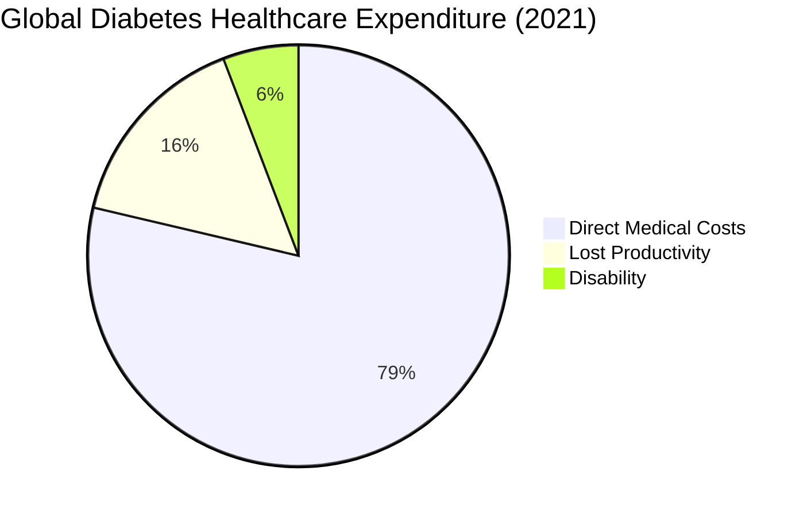

## Type 2 Diabetes: A Global Epidemic

Type 2 Diabetes Mellitus (T2DM) represents one of the most pressing public health challenges of the 21st century, affecting over 537 million adults worldwide as of 2021, with projections reaching 783 million by 2045.

<Warning>
  **Alarming Statistics:**
  - 1 in 10 adults globally has diabetes (90% Type 2)
  - 6.7 million deaths annually
  - $966 billion in healthcare costs (2021)
  - 1 in 2 adults with diabetes are undiagnosed
</Warning>

## Pathophysiology

### Disease Progression

<AccordionGroup>
  <Accordion title="Stage 1: Insulin Resistance" icon="1">
    **Mechanism:**
    - Cells become less responsive to insulin
    - Pancreatic β-cells compensate by producing more insulin
    - Hyperinsulinemia maintains normal blood glucose initially
    
    **Risk Factors:**
    - Obesity (especially visceral adiposity)
    - Physical inactivity
    - Genetic predisposition
    - Chronic inflammation
    
    **Duration:** Can persist for years asymptomatically
  </Accordion>

  <Accordion title="Stage 2: Prediabetes" icon="2">
    **Diagnostic Criteria:**
    - Fasting glucose: 100-125 mg/dL (IFG)
    - 2-hour OGTT: 140-199 mg/dL (IGT)
    - HbA1c: 5.7-6.4%
    
    **Prevalence:**
    - 374 million adults globally (2021)
    - 5-10% annual progression to diabetes
    
    **Intervention Window:**
    - Lifestyle modification highly effective
    - 58% risk reduction with intensive lifestyle intervention
    - Metformin reduces progression by 31%
  </Accordion>

  <Accordion title="Stage 3: Type 2 Diabetes" icon="3">
    **Diagnostic Criteria:**
    - Fasting glucose ≥ 126 mg/dL
    - 2-hour OGTT ≥ 200 mg/dL
    - HbA1c ≥ 6.5%
    - Random glucose ≥ 200 mg/dL with symptoms
    
    **Metabolic Dysfunction:**
    - β-cell failure (reduced insulin secretion)
    - Persistent insulin resistance
    - Hepatic glucose overproduction
    - Impaired incretin effect
  </Accordion>

  <Accordion title="Stage 4: Complications" icon="4">
    **Microvascular:**
    - Retinopathy (leading cause of blindness)
    - Nephropathy (leading cause of ESRD)
    - Neuropathy (diabetic foot ulcers)
    
    **Macrovascular:**
    - Coronary artery disease (2-4x risk)
    - Stroke (2-3x risk)
    - Peripheral arterial disease
    
    **Other:**
    - Increased infection risk
    - Cognitive decline
    - Depression (2x prevalence)
  </Accordion>
</AccordionGroup>

## Risk Factors

### Non-Modifiable Factors

| Factor | Impact | Evidence |
|--------|--------|----------|
| **Age** | Each decade increases risk by ~30% | Strong (RR: 1.3 per decade) |
| **Ethnicity** | South Asian, African, Hispanic at higher risk | Strong (RR: 2-6x vs. Caucasian) |
| **Family History** | First-degree relative doubles risk | Strong (RR: 2.0-3.5) |
| **Genetic Variants** | >400 loci associated with T2DM | Moderate (Polygenic risk) |
| **Gestational Diabetes** | 7x increased lifetime risk | Strong (RR: 7.4) |

### Modifiable Factors

| Factor | Impact | Evidence | Intervention Effectiveness |
|--------|--------|----------|---------------------------|
| **Obesity** | BMI >30: 20-40x risk | Very Strong (RR: 20-40) | 5-10% weight loss: 58% ↓ risk |
| **Physical Inactivity** | <150 min/week moderate activity | Strong (RR: 1.5-2.0) | Regular exercise: 30-50% ↓ risk |
| **Diet** | High processed foods, sugar, red meat | Moderate (RR: 1.2-1.5) | Mediterranean diet: 20-30% ↓ risk |
| **Smoking** | Current smokers | Moderate (RR: 1.4) | Cessation: gradual risk reduction |
| **Sleep** | <6 or >9 hours/night | Moderate (RR: 1.3) | Optimal 7-8 hours recommended |

## Clinical Risk Scores

### Existing Risk Prediction Tools

<Tabs>
  <Tab title="Finnish Diabetes Risk Score (FINDRISC)">
    **Components:**
    - Age
    - BMI
    - Waist circumference
    - Physical activity
    - Vegetable/fruit consumption
    - Blood pressure medication
    - High glucose history
    - Family history
    
    **Performance:**
    - AUROC: 0.72-0.87
    - Simple, non-invasive
    - Widely validated
    
    **Limitations:**
    - No laboratory values
    - Limited to European populations
  </Tab>
  
  <Tab title="Framingham Diabetes Risk Score">
    **Components:**
    - Age
    - Sex
    - BMI
    - Parental diabetes
    - HDL cholesterol
    - Triglycerides
    - Fasting glucose
    - Blood pressure
    
    **Performance:**
    - AUROC: 0.85
    - 8-year risk prediction
    - Requires lab values
    
    **Limitations:**
    - Developed in predominantly white population
    - Requires fasting labs
  </Tab>
  
  <Tab title="ADA Risk Test">
    **Components:**
    - Age
    - Sex
    - Family history
    - High blood pressure
    - Physical activity
    - Weight/height
    - Race/ethnicity
    
    **Performance:**
    - AUROC: 0.74
    - Screening tool
    - Online self-assessment
    
    **Limitations:**
    - Not predictive model
    - High false positive rate
  </Tab>
</Tabs>

## Prevention Strategies

### Evidence-Based Interventions

<CardGroup cols={2}>
  <Card title="Lifestyle Modification" icon="dumbbell">
    **Diabetes Prevention Program (DPP)**
    - 7% weight loss goal
    - 150 min/week moderate activity
    - Low-fat, calorie-restricted diet
    - Behavioral support
    
    **Results:** 58% risk reduction over 3 years
  </Card>
  
  <Card title="Pharmacologic Intervention" icon="pills">
    **Metformin**
    - 850mg twice daily
    - For high-risk prediabetes
    - Especially effective if BMI ≥35, age <60
    
    **Results:** 31% risk reduction over 3 years
  </Card>
  
  <Card title="Dietary Approaches" icon="apple-whole">
    **Mediterranean Diet**
    - High fruits, vegetables, whole grains
    - Olive oil, nuts, fish
    - Limited red meat, processed foods
    
    **Results:** 20-30% lower diabetes incidence
  </Card>
  
  <Card title="Bariatric Surgery" icon="hospital">
    **For Severe Obesity (BMI ≥35)**
    - Gastric bypass
    - Sleeve gastrectomy
    - Metabolic surgery
    
    **Results:** 80% diabetes remission, 75% ↓ incidence
  </Card>
</CardGroup>

## Economic Burden

### Direct and Indirect Costs

<Info>
  **United States (2017):**
  - Total costs: $327 billion
  - $237 billion in direct medical costs
  - $90 billion in reduced productivity
  - $1 in $4 healthcare dollars spent on diabetes care
  - Average medical expenditure for people with diabetes: $16,752/year (2.3x higher than without)
</Info>

### Cost-Effectiveness of Prevention

| Intervention | Cost per QALY | Classification |
|--------------|---------------|----------------|
| Intensive Lifestyle (DPP) | $8,181 | Highly cost-effective |
| Metformin | $1,191 | Highly cost-effective |
| Standard lifestyle counseling | $14,300 | Cost-effective |
| Bariatric surgery (high-risk) | $25,000 | Cost-effective |

<Note>
  WHO threshold for cost-effectiveness: <3× GDP per capita (~$150,000 in U.S.)
</Note>

## Why AI/ML for Risk Prediction?

### Limitations of Traditional Risk Scores

1. **Simple Linear Models**: Assume linear relationships between risk factors
2. **Limited Features**: Typically 5-10 variables
3. **No Temporal Patterns**: Static snapshot, ignore disease trajectories
4. **Population-Specific**: Poor generalization across ethnicities
5. **Manual Feature Engineering**: Require clinical expertise

### Advantages of Deep Learning Approaches

<AccordionGroup>
  <Accordion title="High-Dimensional Data" icon="database">
    - Process hundreds of features simultaneously
    - EHR data: diagnoses, labs, medications, vitals
    - Genetic data: polygenic risk scores
    - Social determinants: zip code, socioeconomic status
  </Accordion>

  <Accordion title="Non-Linear Relationships" icon="chart-network">
    - Capture complex interactions (e.g., BMI × physical activity × genetics)
    - Learn hierarchical representations
    - Identify novel risk patterns
  </Accordion>

  <Accordion title="Temporal Dynamics" icon="clock">
    - LSTMs model disease trajectories
    - Identify critical transition periods
    - Predict risk acceleration/deceleration
  </Accordion>

  <Accordion title="Personalized Predictions" icon="user">
    - Individual-level risk stratification
    - Subgroup-specific models
    - Continuous risk updates as new data arrives
  </Accordion>

  <Accordion title="Improved Performance" icon="trophy">
    - AUROC 0.85-0.92 (vs. 0.72-0.87 for traditional scores)
    - Better calibration
    - Higher sensitivity at fixed specificity
  </Accordion>
</AccordionGroup>

## Our Contribution

This project advances the field by:

1. **Multimodal Integration**: Combines clinical risk prediction with computer vision-based dietary assessment
2. **Real-Time Intervention**: Provides actionable nutrition recommendations at point of care
3. **Interpretability**: Uses SHAP values and attention mechanisms for clinical trust
4. **Production-Ready**: Deployable API for EHR integration
5. **Open Science**: Reproducible methods using publicly available MIMIC-IV data

## References

<Accordion title="View Key References">
1. Saeedi P, et al. "Global and regional diabetes prevalence estimates for 2019 and projections for 2030 and 2045." *Diabetes Res Clin Pract* 2019;157:107843.

2. Knowler WC, et al. "Reduction in the incidence of type 2 diabetes with lifestyle intervention or metformin." *N Engl J Med* 2002;346(6):393-403.

3. Lindström J, et al. "The Finnish Diabetes Prevention Study (DPS)." *Diabetes Care* 2003;26(12):3230-6.

4. American Diabetes Association. "Standards of Medical Care in Diabetes—2024." *Diabetes Care* 2024;47(Suppl 1).

5. Zheng Y, et al. "Global aetiology and epidemiology of type 2 diabetes mellitus and its complications." *Nat Rev Endocrinol* 2018;14(2):88-98.

6. Noble D, et al. "Risk models and scores for type 2 diabetes: systematic review." *BMJ* 2011;343:d7163.

7. Xie Y, et al. "Deep learning-based diabetes risk prediction with electronic health records." *JAMA Netw Open* 2022;5(3):e2224491.
</Accordion>

## Next Steps

<CardGroup cols={2}>
  <Card title="ML in Healthcare" icon="brain" href="/research/ml-healthcare">
    Review machine learning applications in healthcare
  </Card>
  <Card title="Related Work" icon="book" href="/research/related-work">
    Survey of AI-based diabetes prediction
  </Card>
  <Card title="Our Methodology" icon="flask" href="/research/experimental-design">
    Detailed experimental design
  </Card>
  <Card title="Results" icon="chart-bar" href="/research/results">
    Model performance and validation
  </Card>
</CardGroup>
